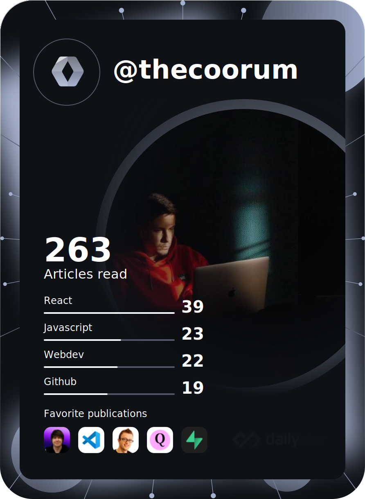

<h1 align="center">Hi 👋, I'm Yaroslav</h1>
<h3 align="center">A passionate frontend developer</h3>

- 🔭 I’m currently working on **[Booqable Rental Software](https://booqable.com)**
- 🌱 I’m currently learning **Ruby on Rails**
- 👨‍💻 Working on **Track - all your incomes and expenses in one place**
- 📫 How to reach me: **[mail](mailto:coorum.y@gmail.com)**

### Connect with me ✉️

### Languages and Tools 🔧

### What I do 💻
 

### What I read 📚

